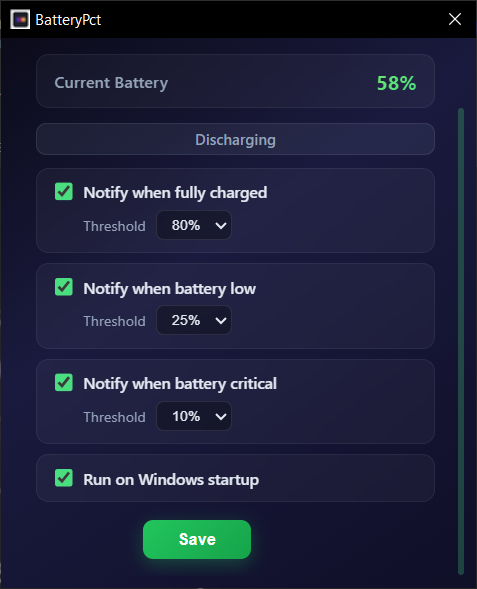

# BatteryPct

**BatteryPct** is a lightweight Windows utility that displays your battery percentage and helps you maintain better charging habits with smart battery alerts.

Many Windows 10 users want a simple way to monitor battery percentage while receiving timely reminders to unplug or recharge. BatteryPct does exactly that—no unnecessary features, no heavy resource usage.

## Features

- 🔋 Displays current battery percentage.
- 🔔 **80% Battery Alert** — popup notification + whistle sound to remind you to unplug.
- ⚠️ **25% Low Battery Alert** — popup notification + whistle sound to remind you to charge.
- 🚀 Optional **Start with Windows** support.
- 🖥️ Runs quietly in the background.
- 📢 Clean popup notifications with sound alerts.
- ⚡ Extremely lightweight with minimal CPU and memory usage.

## Why Choose BatteryPct

- 🪶 Lightweight and responsive.
- ⚡ Minimal CPU and memory usage.
- 💻 Designed to run in the background without slowing down your PC.
- 🔋 Encourages better charging habits with timely notifications.
- 🎯 Focused on one job—monitoring battery and notifying when it matters.

## Screenshot

  

## Download

Download the latest version from the **[Releases](https://github.com/Rohit5984/Battery_Percentage/releases/tag/1.0.0)** page.

## Installation

1. Download the latest release.
2. Extract the files if required.
3. Run `BatteryPct.exe`.
4. (Optional) Enable **Start with Windows**.
5. Keep BatteryPct running to receive battery notifications.

## Battery Alerts

| Battery Level | Action |
| ------------- | ------ |
| **80%**       | Popup notification + whistle sound (Unplug charger) |
| **25%**       | Popup notification + whistle sound (Charge your laptop) |

## Built With

- **Tauri**

## Roadmap

- Custom battery alert percentages
- Multiple notification sounds
- Dark mode
- Battery usage statistics
- Additional customization options

## Contributing

Bug reports, feature requests, and pull requests are welcome. If you find BatteryPct useful, please consider giving this repository a ⭐.

## License

This project is licensed under the MIT License.
